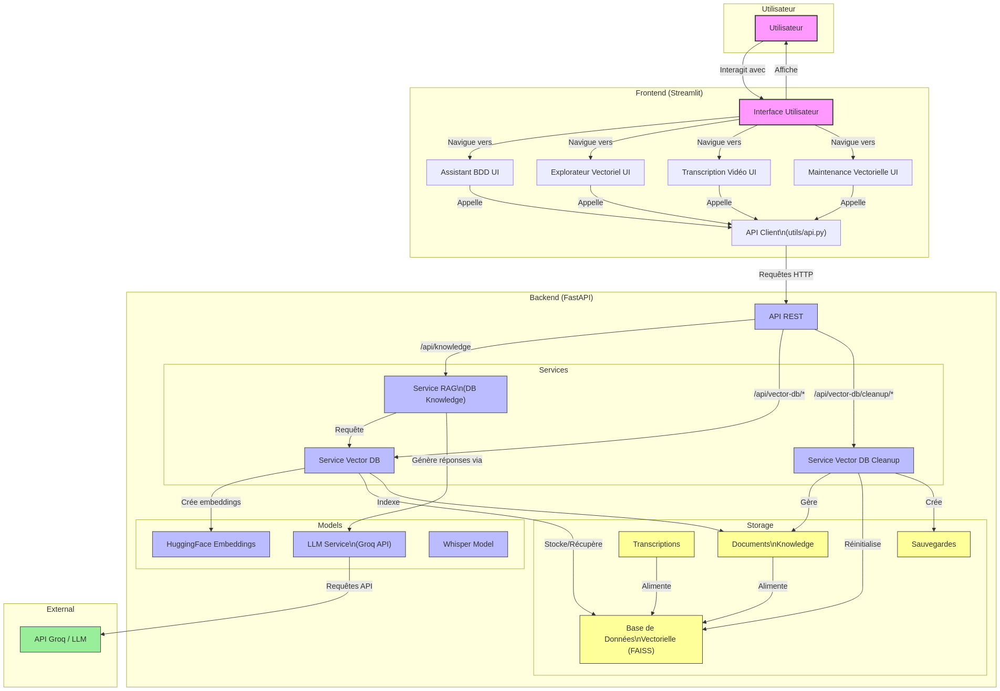

# Assistant de Base de Données IA

Une application moderne combinant interface Streamlit et intelligence artificielle pour répondre aux questions sur les bases de données, générer des requêtes SQL et explorer les données à partir de connaissances indexées dans une base vectorielle.


## 📋 Table des matières

- [Vue d'ensemble](#vue-densemble)
- [Fonctionnalités](#fonctionnalités)
- [Architecture](#architecture)
- [Configuration](#configuration)
  - [Prérequis](#prérequis)
  - [Installation](#installation)
  - [Configuration de l'environnement](#configuration-de-lenvironnement)
  - [Initialisation de la base vectorielle](#initialisation-de-la-base-vectorielle)
- [Utilisation](#utilisation)
  - [Démarrage des services](#démarrage-des-services)
  - [Accès à l'interface](#accès-à-linterface)
- [Architecture RAG (Retrieval Augmented Generation)](#architecture-rag-retrieval-augmented-generation)
- [Technologies utilisées](#technologies-utilisées)
- [Structure du projet](#structure-du-projet)
- [Maintenance de la base vectorielle](#maintenance-de-la-base-vectorielle)

## Vue d'ensemble

L'Assistant de Base de Données IA est une application qui permet aux utilisateurs de poser des questions sur les concepts de bases de données, de générer des requêtes SQL à partir de descriptions en langage naturel, et d'explorer des données structurées et non structurées grâce à une base de connaissances vectorielle.

L'application utilise une architecture moderne avec un backend FastAPI et un frontend Streamlit, avec une implémentation de la technique RAG (Retrieval Augmented Generation) pour fournir des réponses précises et contextuelles.

## Fonctionnalités

- **Assistant Base de Données** : Posez des questions sur les concepts de base de données, SQL et les techniques d'optimisation
- **Explorateur de Base Vectorielle** : Visualisez, recherchez et téléchargez des documents dans la base de connaissances vectorielle
- **Support multiformat** : Importation de connaissances à partir de divers formats de fichiers (TXT, PDF, DOCX, CSV, etc.)
- **Maintenance vectorielle** : Interface d'administration pour gérer les fichiers de connaissances et optimiser la base vectorielle

## Architecture

L'application est composée de deux modules principaux :

1. **Backend (FastAPI)** : API REST fournissant les services d'IA et d'accès aux données
2. **Frontend (Streamlit)** : Interface utilisateur interactive et réactive

La communication entre les deux modules se fait via des appels API REST.

## Configuration

### Prérequis

- Python 3.9+ 
- pip (gestionnaire de packages Python)
- Accès à l'API Groq (ou autre service de LLM compatible)

### Installation

1. Clonez le dépôt :

```bash
git clone https://github.com/votre-compte/assistant-bdd-ia.git
cd assistant-bdd-ia
```

2. Créez et activez un environnement virtuel :

```bash
# Sous Linux/macOS
python3 -m venv venv
source venv/bin/activate

# Sous Windows
python -m venv venv
venv\Scripts\activate
```

3. Installez les dépendances :

```bash
# Installez les dépendances du backend
cd backend
pip install -r requirements.txt

# Installez les dépendances du frontend
cd ../frontend
pip install -r requirements.txt
```

### Configuration de l'environnement

1. Créez un fichier `.env` dans le dossier `backend` :

```bash
cd ../backend
# Cree un fichier `.env` dans le dossier `backend`
```

2. Ajoutez vos clés API et configurez les variables d'environnement dans le fichier `.env` :

```
# API Groq pour les modèles de langage
GROQ_API_KEY=votre_clé_api_groq

```

### Initialisation de la base vectorielle

Pour initialiser la base de données vectorielle avec des connaissances de base sur les bases de données :

```bash
cd backend
python scripts/initialize_db.py
```

Ce script va créer la base vectorielle et y indexer les documents présents dans le dossier `backend/knowledge`.

## Utilisation

### Démarrage des services

1. Démarrez le backend (dans un terminal) :

```bash
cd backend
pip install -r requirements.txt
uvicorn app:app --reload --port 8000
```

2. Démarrez le frontend (dans un autre terminal) :

```bash
cd frontend
pip install -r requirements.txt
streamlit run app.py
```

### Accès à l'interface

Ouvrez votre navigateur et accédez à l'URL :

```
http://localhost:8501
```

## Architecture RAG (Retrieval Augmented Generation)

L'Assistant de Base de Données utilise l'architecture RAG (Retrieval Augmented Generation) pour améliorer la qualité des réponses générées par le modèle de langage. Voici comment fonctionne le processus :

Le diagramme ci-dessous illustre les interactions entre les différents composants du système:


1. **Indexation des documents** :
   - Les documents de connaissance sont divisés en chunks de taille appropriée
   - Chaque chunk est transformé en embedding vectoriel avec le modèle HuggingFace "all-MiniLM-L6-v2"
   - Les embeddings sont stockés dans une base de données vectorielle FAISS pour une recherche efficace

2. **Traitement des questions** :
   - La question de l'utilisateur est transformée en embedding vectoriel
   - Une recherche de similarité est effectuée dans la base FAISS pour récupérer les documents les plus pertinents
   - Les documents pertinents sont fusionnés avec la question dans un prompt enrichi

3. **Génération de réponse augmentée** :
   - Le modèle de langage (Mixtral 8x7B via Groq) reçoit le prompt enrichi
   - Le contexte supplémentaire aide le modèle à générer une réponse plus précise et factuelle
   - L'historique de conversation est également inclus pour maintenir la cohérence des échanges

4. **Gestion de la mémoire de conversation** :
   - Les conversations longues sont automatiquement résumées pour rester dans les limites du contexte
   - Les résumés préservent les informations techniques importantes

Cette architecture permet à l'assistant de fournir des réponses plus précises sur les bases de données en s'appuyant sur des connaissances indexées plutôt que sur les seules connaissances du modèle de base.

## Technologies utilisées

### Backend
- **FastAPI** : Framework API web moderne et performant
- **Langchain** : Bibliothèque pour construire des applications avec des LLM
- **FAISS** : Bibliothèque de recherche de similarité vectorielle développée par Facebook AI
- **SQLAlchemy** : ORM pour la gestion des données relationnelles
- **HuggingFace Embeddings** : Modèles de transformation de texte en vecteurs
- **Groq API** : Service d'inférence pour les grands modèles de langage

### Frontend
- **Streamlit** : Framework pour créer des applications frontend avec python
- **Pandas** : Manipulation et analyse de données
- **Matplotlib** : Visualisation de données
- **Requests** : Client HTTP pour communiquer avec l'API

### Pourquoi ces technologies ?

- **FastAPI** a été choisi pour sa performance et sa facilité d'intégration avec les modèles ML
- **Streamlit** permet de créer rapidement des interfaces utilisateur réactives 
- **FAISS** offre des performances exceptionnelles pour la recherche vectorielle à grande échelle
- **Langchain** simplifie l'intégration des LLM dans les workflows d'applications
- **Groq API** fournit un accès rapide aux LLM 
- **HuggingFace Embeddings** permettent d'utiliser des modèles d'embedding locaux, sans dépendance à des API externes

## Structure du projet

```
assistant-bdd-ia/
├── backend/
│   ├── app.py                   # Point d'entrée de l'API FastAPI
│   ├── database/                # Stockage des bases de données SQLite et vectorielles
│   │   └── backups/             # Sauvegardes des fichiers de connaissance
│   ├── knowledge/               # Documents de connaissance à indexer
│   ├── models/                  # Modèles de données et de requêtes
│   ├── scripts/                 # Scripts utilitaires (initialisation, maintenance)
│   └── services/                # Services métier (SQL, RAG, historique)
│       └── vector_db_cleanup.py # Service de nettoyage de la base vectorielle
├── frontend/
│   ├── app.py                   # Point d'entrée de l'application Streamlit
│   ├── modules/                 # Modules de l'interface utilisateur
│   │   └── vector_db_cleanup.py # Interface de maintenance vectorielle
│   └── utils/                   # Utilitaires (connexion API, styles)
└── README.md                    # Documentation du projet
```

## Maintenance de la base vectorielle

L'application comprend une interface d'administration pour gérer la base de connaissances vectorielle. Cette fonctionnalité vous permet de :

### Gestion des fichiers de connaissance

- **Explorer les fichiers** : Visualisez tous les fichiers de connaissance avec leurs métadonnées (taille, date de modification, catégorie)
- **Filtrer par catégorie** : Affichez uniquement les fichiers d'un certain type (documents, textes, etc.)
- **Supprimer des fichiers** : Supprimez des fichiers individuels ou tous les fichiers d'une catégorie spécifique
- **Créer des sauvegardes** : Sauvegardez tous vos fichiers de connaissance avant d'effectuer des modifications importantes

### Maintenance de la base vectorielle

- **Vider la base vectorielle** : Réinitialisez l'index vectoriel tout en conservant les fichiers sources
- **Réindexer les fichiers** : Reconstruisez l'index vectoriel à partir des fichiers existants
- **Statistiques et diagnostics** : Visualisez des statistiques détaillées sur votre base vectorielle (nombre de documents, dimensions, distribution des sources)

### Réinitialisation complète

- **Réinitialisation du système** : Option pour réinitialiser complètement le système en supprimant tous les fichiers et en vidant la base vectorielle
- **Sauvegarde automatique** : Une sauvegarde est automatiquement créée avant toute réinitialisation complète pour éviter les pertes de données accidentelles

### Comment accéder à la maintenance

1. Naviguez vers la page "Maintenance Vectorielle" dans la barre latérale de l'application
2. Utilisez les onglets pour accéder aux différentes fonctionnalités de maintenance
3. Suivez les instructions à l'écran pour effectuer les opérations souhaitées

Cette fonctionnalité est particulièrement utile pour maintenir les performances optimales du système RAG et résoudre les problèmes potentiels avec les documents de la base de connaissances.